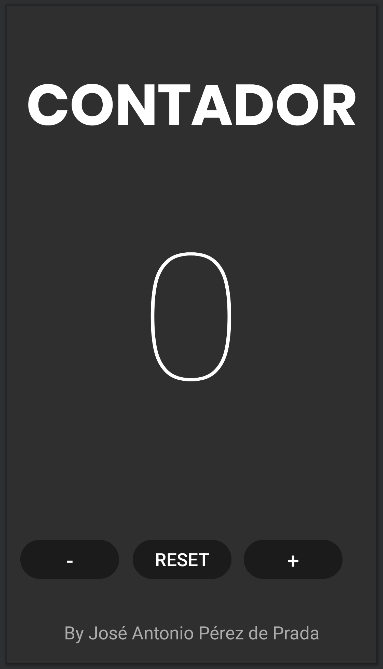

# ANDROID
## Tarea 1
- **Autor**: *José Antonio Pérez de Prada*
- **Asignatura**: Multimedia

### Enunciado
Deberás recrear en android la aplicación del contador que se os proporciona. El diseño se os pasará 
por figma (abajo teneis el enlace). En este primer ejercicio solo debes hacer la parte visual, nada 
de lógica. Asegurate de que el resultado final sea identico al proporcionado, en tu criterio queda 
elegir el o los tipos de layouts que utilizarás. Mediante figma obtén el tipo de fuente, colores 
etc que debes utilizar en tu aplicación.

### Resultado
#### Ventanas
Este ejercicio solo tiene la siguiente ventana:

Esta ventana dispone de dos contenedores de texto y 3 botones:
- Título de la ventana: **Contador**
- Contador: **0**(en su estado actual)
- Botón para restar un valor al *contador*: **-**
- Botón para restablecer el valor del *contador*: **RESET**
- Botón para sumar un valor al *contador*: **+**
- Firma del autor: **By José Antonio Pérez de Prada**