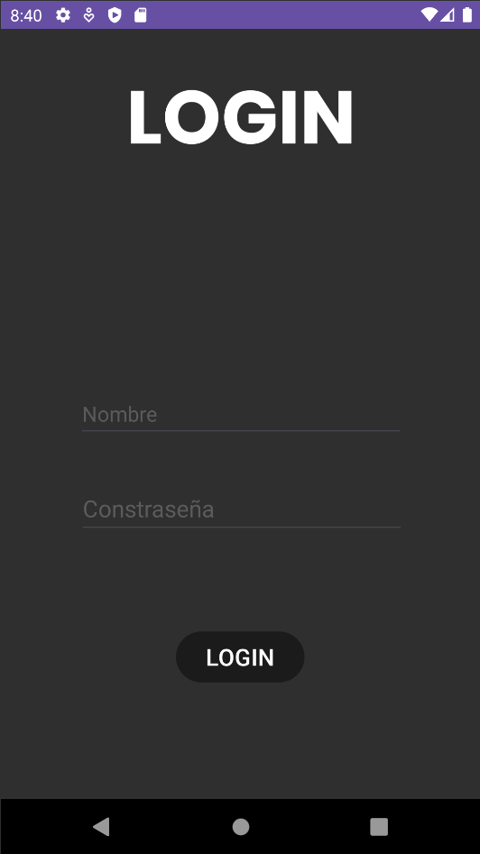
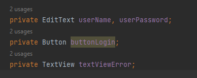
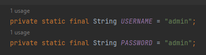
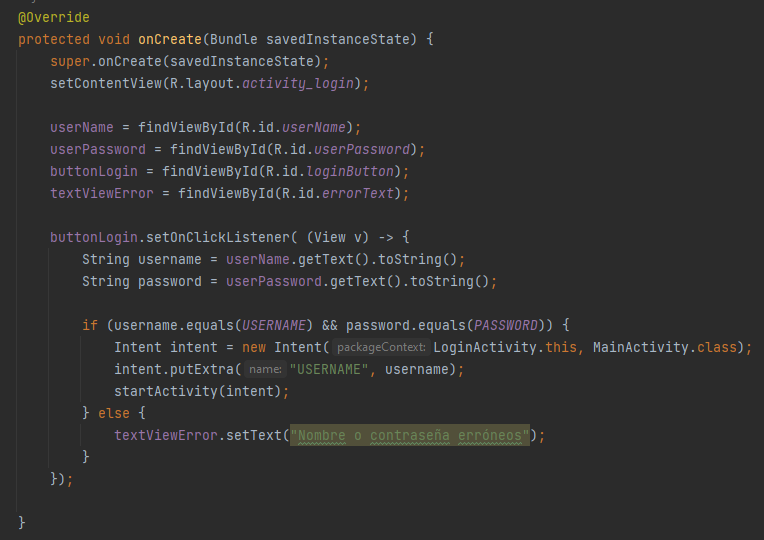
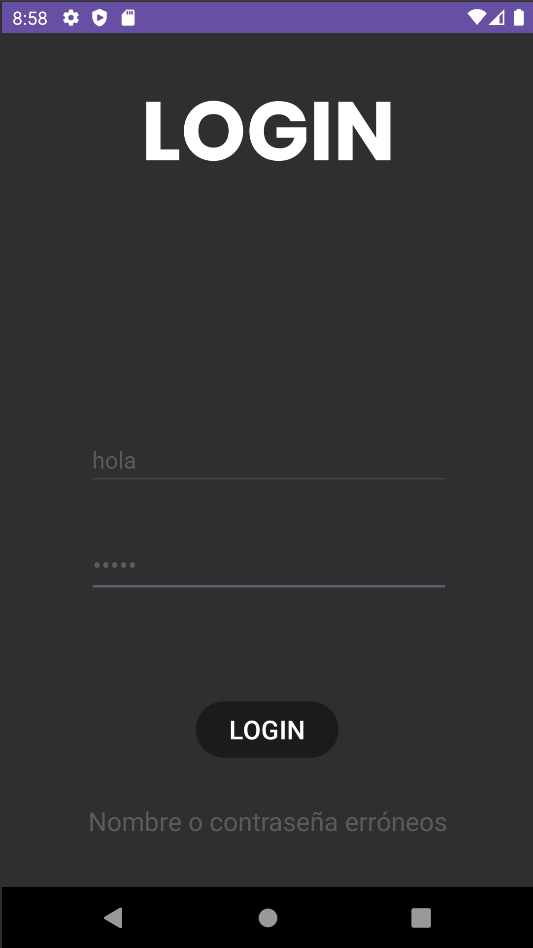
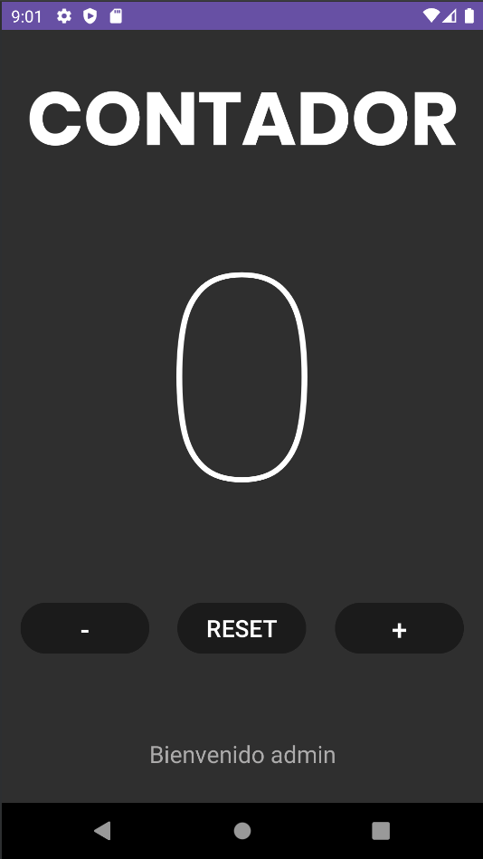
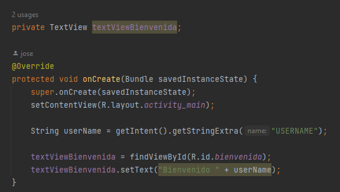

# ANDROID
# Tarea 2
- **Autor**: *José Antonio Pérez de Prada*
- **Asignatura**: Multimedia

## Enunciado
Crea la segunda pantalla en el mismo proyecto(investiga como). Deberás realizar un lógin tal y como se muestra en el figma, en el caso de que el usuario y contraseña sean admin en el TextView de abajo saldrá “Usuario y contraseña correcta” en caso contrario “Usuario o contraseña incorrecta”. Investigar por vuestra cuenta como iniciar la aplicación en la Activity login. Pista → se configura en el AndroidManifest.xml. Una vez que iniciemos el login deberá pasar a la pantalla del contador pasando el dato del nombre del usuario (aparecerá en la parte baja de la pantalla de contador donde ponía “by nombre_alumno”).

## Resultado
### Ventanas
Este ejercicio cuenta con dos ventanas:

#### Ventana de Login

Es la vetana principal del proyecto, es decir, es con la que se iniciará la aplicación. Para acceder a la segunda ventana de la aplicación ,el usuario deberá introducir un nombre y una contraseña concretos, los cuales como se pide en el enunciado son en ambos casos *admin*.

El código por el cual se realiza esta comprobación es el siguiente: 

Creamos cuatro variables globales privadas por cada uno de los elementos que necesitamos para el funcionamiento del programa: los dos campos de introducción de texto, el botón de login y el texto que mostrará si nos hemos equivocado con los datos a introducir.

También tenemos dos constantes que son el nombre y contraseña correctos para entrar a la segunda ventana.

Luego está el código en cuestión, en el cual a cada variable representante de los elementos de la ventana se les da como valor una referencia al elemento en cuestión (mediante *findViewById()*). Después se crear un escuchador de eventos en el botón de login y se obtiene los valores escritos en los dos inputs de texto para verificar si son idénticos a los de las constantes.

Si se da el caso de que son iguales, se instancia un objeto de tipo [*Intent*](https://developer.android.com/guide/components/intents-filters?hl=es-419) para poder interactuar con la segunda ventana. Esto se hace para que el se cambie a la ventana muestra la segunda vista. Le pasa a la ventana el nombre del usuario y se inicias la segunda actividad (la segunda vista).

En el caso contrario a este, lo que se hace es cambiar el valor del texto situado debajo del botón de login por la cadena: *"Nombre o contraseña erróneos"*. Este sería el caso:

#### Ventana del contador

Esta es la ventana que se mostrará tras introducir correctamente el nombre y la contraseña. Donde se muestra el mismo contenido que en la tarea 1 (un campo de texto como título de la ventana, otro campo de texto que caracteriza al temporizador, y tres botones de acción para incrementar, reducir o resetear el contador y por último un texto). La diferencia está en que el texto de la zona inferior de la pantalla ya no muestra el "*By José Antonio Pérez de Prada*" sino que muestra un mensaje de bienvenida para el usuario.

El nombre del usuario no está metido directamente como parámetro del texto, sino que lo hemos traído de la ventana anterior (la de login). Este el código necesario para recibir el valor de la variable username vista en el código de la vista de login:

